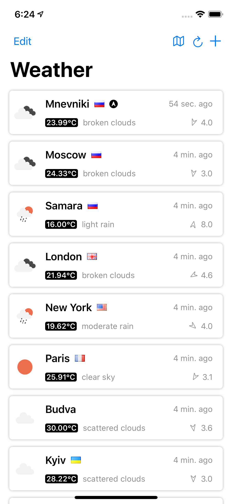

# Weather
The weather app on SwiftUI using [OpenWeather API](https://openweathermap.org/api)

### App uses and implements
* SwiftUI (incl. @ObservedObject, @State, @Environment)
* CoreData
* MapKit (UIKit to SwiftUI)
* Codable + API integration (OpenWeather)
* Combine
* Generics
* Timer
* Target Properties

### Features
* Shows a list of added locations with current weather
* Shows the weather for current user location if access granted
* Ability to add, remove, reorder locations
* Search locations by name
* Show locations on the map
* Keeps locations with the latest weather in DB
* Limits weather updates to once in 10 minutes

